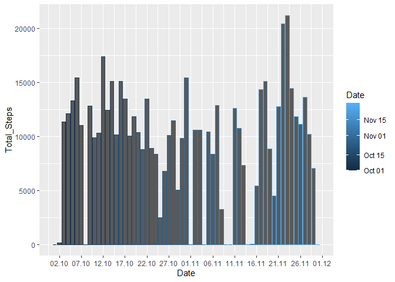
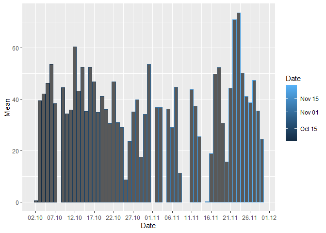
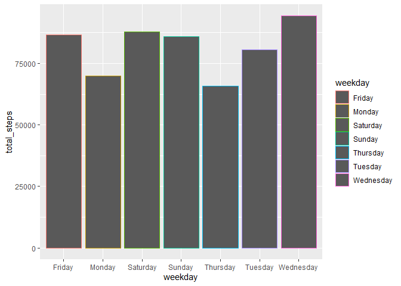
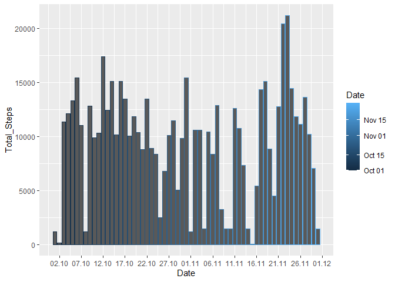
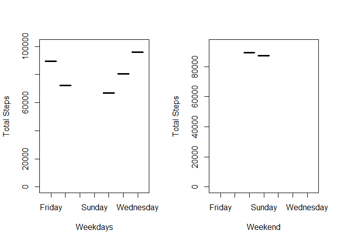

In this document, personal movement data will be analysed in exploratory way.
The data is about taken steps in 61 days.

### PREPROCESSING THE DATA

Let's unzip our dataset.


```r
unzip("./activity.zip", exdir = getwd())
```

This is a comma seperated file. So we create our dataframe and deploy it in the variable data. 

```r
curr_locale <- Sys.getlocale("LC_TIME")
Sys.setlocale("LC_TIME","en_US.UTF-8")
```

```
## Warning in Sys.setlocale("LC_TIME", "en_US.UTF-8"): İşletim Sistemi yereli
## "en_US.UTF-8" e ayarlama isteğinin gerçekleştirelemeyeceğini raporladı
```

```
## [1] ""
```

```r
Sys.setlocale("LC_TIME",curr_locale)
```

```
## [1] "Turkish_Turkey.1254"
```

```r
dev_null <- Sys.setlocale("LC_TIME", "english")
data <- read.csv('./activity.csv', sep = ",")
```

Let's have a look of the first observations of the data. 

```r
head(data)
```

```
##   steps       date interval
## 1    NA 2012-10-01        0
## 2    NA 2012-10-01        5
## 3    NA 2012-10-01       10
## 4    NA 2012-10-01       15
## 5    NA 2012-10-01       20
## 6    NA 2012-10-01       25
```
In the dataset there is a column named steps which we are interested mostly. It seems there are NA's in our data. And there is a date column and interval column. So our dataset is kind of a timeseries dataset. Let's have a look of structure of the data.  


```r
str(data)
```

```
## 'data.frame':	17568 obs. of  3 variables:
##  $ steps   : int  NA NA NA NA NA NA NA NA NA NA ...
##  $ date    : chr  "2012-10-01" "2012-10-01" "2012-10-01" "2012-10-01" ...
##  $ interval: int  0 5 10 15 20 25 30 35 40 45 ...
```
Date is deployed as character and others are integers. And dimension of our data:

```r
dim(data)
```

```
## [1] 17568     3
```
We know we have NA values, and how many values are NA?

```r
colSums(is.na(data))
```

```
##    steps     date interval 
##     2304        0        0
```
Son only steps column has NAs.
What about the ratio of NA values?

```r
sum(is.na(data$steps))/length(data$steps)
```

```
## [1] 0.1311475
```
Now let's transform our date column from char to "YYMMDD" date format and create a new column as factor that shows which weekday is the date.
So we will be able to have opinions of subject's behaviour in weekdays.  

```r
data$date <- as.Date(data$date)

data$weekday <- as.factor(weekdays(data$date))

summary(data)
```

```
##      steps             date               interval           weekday    
##  Min.   :  0.00   Min.   :2012-10-01   Min.   :   0.0   Friday   :2592  
##  1st Qu.:  0.00   1st Qu.:2012-10-16   1st Qu.: 588.8   Monday   :2592  
##  Median :  0.00   Median :2012-10-31   Median :1177.5   Saturday :2304  
##  Mean   : 37.38   Mean   :2012-10-31   Mean   :1177.5   Sunday   :2304  
##  3rd Qu.: 12.00   3rd Qu.:2012-11-15   3rd Qu.:1766.2   Thursday :2592  
##  Max.   :806.00   Max.   :2012-11-30   Max.   :2355.0   Tuesday  :2592  
##  NA's   :2304                                           Wednesday:2592
```
### PLOTTING THE DATA
Now we have a better form of data and let's take a look in which day our subjects have more steps?
First we make groups to see steps taken each day.

```r
library(dplyr)
```

```
## 
## Attaching package: 'dplyr'
```

```
## The following objects are masked from 'package:stats':
## 
##     filter, lag
```

```
## The following objects are masked from 'package:base':
## 
##     intersect, setdiff, setequal, union
```

```r
steps_by_days <- aggregate(data$steps, by=list(date = data$date), FUN=sum, na.rm=TRUE)
names(steps_by_days) <- c("Date","Total_Steps")
```
Now we have a group of dates.
Let's take a look at the plot of steps taken in days. 


```r
library(ggplot2)

g <- ggplot(steps_by_days,aes(Date,Total_Steps))
g + geom_col(aes(colour=Date))  +scale_x_date(date_breaks = "5 days", date_labels = "%d.%m")
```

<!-- -->

It looks like we have maximum steps number in date 23.11. And probably because of NA values we have zero bars.
Let's find average value of steps taken in days in same way of grouping.

```r
mean_by_days <- aggregate(data$steps, by=list(weekday = data$date), FUN = mean, na.rm=TRUE)
```


```r
names(mean_by_days) <- c("Date","Mean")
```


```r
g <- ggplot(mean_by_days,aes(Date, Mean))
g + geom_col(aes(colour=Date))  +scale_x_date(date_breaks = "5 days", date_labels = "%d.%m")
```

```
## Warning: Removed 8 rows containing missing values (position_stack).
```

<!-- -->

And the median of steps in each days:

```r
tapply(data$steps, data$date, median)
```

```
## 2012-10-01 2012-10-02 2012-10-03 2012-10-04 2012-10-05 2012-10-06 2012-10-07 
##         NA          0          0          0          0          0          0 
## 2012-10-08 2012-10-09 2012-10-10 2012-10-11 2012-10-12 2012-10-13 2012-10-14 
##         NA          0          0          0          0          0          0 
## 2012-10-15 2012-10-16 2012-10-17 2012-10-18 2012-10-19 2012-10-20 2012-10-21 
##          0          0          0          0          0          0          0 
## 2012-10-22 2012-10-23 2012-10-24 2012-10-25 2012-10-26 2012-10-27 2012-10-28 
##          0          0          0          0          0          0          0 
## 2012-10-29 2012-10-30 2012-10-31 2012-11-01 2012-11-02 2012-11-03 2012-11-04 
##          0          0          0         NA          0          0         NA 
## 2012-11-05 2012-11-06 2012-11-07 2012-11-08 2012-11-09 2012-11-10 2012-11-11 
##          0          0          0          0         NA         NA          0 
## 2012-11-12 2012-11-13 2012-11-14 2012-11-15 2012-11-16 2012-11-17 2012-11-18 
##          0          0         NA          0          0          0          0 
## 2012-11-19 2012-11-20 2012-11-21 2012-11-22 2012-11-23 2012-11-24 2012-11-25 
##          0          0          0          0          0          0          0 
## 2012-11-26 2012-11-27 2012-11-28 2012-11-29 2012-11-30 
##          0          0          0          0         NA
```
Because of NA's our median is meaningless.
Let's take a look of 5 minute intervals:

```r
five_min_intervals <- filter(data,interval == 5)
```


```r
five_min_intervals
```

```
##    steps       date interval   weekday
## 1     NA 2012-10-01        5    Monday
## 2      0 2012-10-02        5   Tuesday
## 3      0 2012-10-03        5 Wednesday
## 4      0 2012-10-04        5  Thursday
## 5      0 2012-10-05        5    Friday
## 6      0 2012-10-06        5  Saturday
## 7      0 2012-10-07        5    Sunday
## 8     NA 2012-10-08        5    Monday
## 9      0 2012-10-09        5   Tuesday
## 10    18 2012-10-10        5 Wednesday
## 11     0 2012-10-11        5  Thursday
## 12     0 2012-10-12        5    Friday
## 13     0 2012-10-13        5  Saturday
## 14     0 2012-10-14        5    Sunday
## 15     0 2012-10-15        5    Monday
## 16     0 2012-10-16        5   Tuesday
## 17     0 2012-10-17        5 Wednesday
## 18     0 2012-10-18        5  Thursday
## 19     0 2012-10-19        5    Friday
## 20     0 2012-10-20        5  Saturday
## 21     0 2012-10-21        5    Sunday
## 22     0 2012-10-22        5    Monday
## 23     0 2012-10-23        5   Tuesday
## 24     0 2012-10-24        5 Wednesday
## 25     0 2012-10-25        5  Thursday
## 26     0 2012-10-26        5    Friday
## 27     0 2012-10-27        5  Saturday
## 28     0 2012-10-28        5    Sunday
## 29     0 2012-10-29        5    Monday
## 30     0 2012-10-30        5   Tuesday
## 31     0 2012-10-31        5 Wednesday
## 32    NA 2012-11-01        5  Thursday
## 33     0 2012-11-02        5    Friday
## 34     0 2012-11-03        5  Saturday
## 35    NA 2012-11-04        5    Sunday
## 36     0 2012-11-05        5    Monday
## 37     0 2012-11-06        5   Tuesday
## 38     0 2012-11-07        5 Wednesday
## 39     0 2012-11-08        5  Thursday
## 40    NA 2012-11-09        5    Friday
## 41    NA 2012-11-10        5  Saturday
## 42     0 2012-11-11        5    Sunday
## 43     0 2012-11-12        5    Monday
## 44     0 2012-11-13        5   Tuesday
## 45    NA 2012-11-14        5 Wednesday
## 46     0 2012-11-15        5  Thursday
## 47     0 2012-11-16        5    Friday
## 48     0 2012-11-17        5  Saturday
## 49     0 2012-11-18        5    Sunday
## 50     0 2012-11-19        5    Monday
## 51     0 2012-11-20        5   Tuesday
## 52     0 2012-11-21        5 Wednesday
## 53     0 2012-11-22        5  Thursday
## 54     0 2012-11-23        5    Friday
## 55     0 2012-11-24        5  Saturday
## 56     0 2012-11-25        5    Sunday
## 57     0 2012-11-26        5    Monday
## 58     0 2012-11-27        5   Tuesday
## 59     0 2012-11-28        5 Wednesday
## 60     0 2012-11-29        5  Thursday
## 61    NA 2012-11-30        5    Friday
```
These NA's are problem. Average values of steps in 5 minute intervals. 

```r
average_of_five_min_int <- aggregate(five_min_intervals$steps, by = list(average = five_min_intervals$steps), FUN = mean, na.rm=TRUE)
```


```r
average_of_five_min_int
```

```
##   average  x
## 1       0  0
## 2      18 18
```

Average of five minute intervals:

```r
mean(five_min_intervals$steps, na.rm=TRUE)
```

```
## [1] 0.3396226
```
Maximum steps of five minute intervals:

```r
max(five_min_intervals$steps,na.rm = TRUE)
```

```
## [1] 18
```


### FILLING NA'S


Let's take a look at steps taken weekdays:


```r
steps_by_weekdays <- aggregate(data$steps, by=list(weekday = data$weekday), FUN=sum, na.rm=TRUE)
```

```r
names(steps_by_weekdays)= c("weekday","total_steps")
```


```r
steps_by_weekdays[c('weekday','total_steps')]
```

```
##     weekday total_steps
## 1    Friday       86518
## 2    Monday       69824
## 3  Saturday       87748
## 4    Sunday       85944
## 5  Thursday       65702
## 6   Tuesday       80546
## 7 Wednesday       94326
```
We see wednesday is the most steps taken day. 


```r
g <- ggplot(steps_by_weekdays,aes(weekday, total_steps))
g + geom_col(aes(colour=weekday)) 
```

<!-- -->

Let's find the mean of steps taken each weekday. Let's find how many days we have observed the taken steps


```r
length(unique(data$date))
```

```
## [1] 61
```
Now let's redefine our grouped data and see our average of steps in weekdays: 

```r
average_weekdays <- steps_by_weekdays
average_weekdays$total_steps <- average_weekdays$total_steps/61
average_weekdays
```

```
##     weekday total_steps
## 1    Friday    1418.328
## 2    Monday    1144.656
## 3  Saturday    1438.492
## 4    Sunday    1408.918
## 5  Thursday    1077.082
## 6   Tuesday    1320.426
## 7 Wednesday    1546.328
```
And how many intervals do we have in a day?

```r
length(unique(data$interval))
```

```
## [1] 288
```
We can subset each interval and find mean of the steps take by intervals but we don't have much information about intervals. We have too much NA for 5 minute intervals, so mean of them won't be meaningful. 
That's why we can fill NA's with each weekday's average step number by the interval. Let's code what I meant:


```r
average_weekdays$total_steps <- average_weekdays$total_steps / 288
average_weekdays
```

```
##     weekday total_steps
## 1    Friday    4.924750
## 2    Monday    3.974499
## 3  Saturday    4.994763
## 4    Sunday    4.892077
## 5  Thursday    3.739868
## 6   Tuesday    4.584813
## 7 Wednesday    5.369194
```
But for sure we can't have a 4.92 steps to take. We have two options here, Either we can round those numbers up or down according to which side they are close to, or we can distribute for ex 1418 steps to friday NA's. I will take the first way. 


```r
average_weekdays$total_steps <- round(average_weekdays$total_steps)
average_weekdays
```

```
##     weekday total_steps
## 1    Friday           5
## 2    Monday           4
## 3  Saturday           5
## 4    Sunday           5
## 5  Thursday           4
## 6   Tuesday           5
## 7 Wednesday           5
```
So for Mondays and Thursdays we should fill NA'S with 4 and other days we should fill NA's with 5.
Now let's fill NA's with those numbers:


```r
data_filled <- data

for (i in 1:length(data_filled$steps)){
  if ((is.na(data_filled$steps[i])) & (data_filled$weekday[i] == "Friday" | data_filled$weekday[i] == "Saturday" | data_filled$weekday[i] == "Sunday" | data_filled$weekday[i] == "Tuesday" | data_filled$weekday[i] == "Wednesday")){
    data_filled$steps[i] <- 5  }
  if ((is.na(data_filled$steps[i])) & (data_filled$weekday[i] == "Monday" | data_filled$weekday[i] == "Thursday")){
    data_filled$steps[i] <- 4
  }
}
```

Now let's take a look our new data:

```r
head(data_filled)
```

```
##   steps       date interval weekday
## 1     4 2012-10-01        0  Monday
## 2     4 2012-10-01        5  Monday
## 3     4 2012-10-01       10  Monday
## 4     4 2012-10-01       15  Monday
## 5     4 2012-10-01       20  Monday
## 6     4 2012-10-01       25  Monday
```

Mondays were NA and now we filled NA's with 4 for Mondays. 
After imputing NA's we should take a look our plots again.
To calculate total steps taken in each day we will make groups again:


```r
steps_by_days <- aggregate(data_filled$steps, by=list(date = data_filled$date), FUN=sum, na.rm=TRUE)
names(steps_by_days) <- c("Date","Total_Steps")
```

We created groups and let's plot them:


```r
g <- ggplot(steps_by_days,aes(Date,Total_Steps))
g + geom_col(aes(colour=Date))  +scale_x_date(date_breaks = "5 days", date_labels = "%d.%m")
```

<!-- -->

If you take a look of previous version of this plot you can see some bars are higher and most of the gaps are filled.

Now let's compare weekdays and weekends steps taken. 
To do so we will create two different groups: weekdays_steps and weekend_steps

```r
weekdays_steps <- aggregate(data_filled$steps[data_filled$weekday != "Saturday" & data_filled$weekday != "Sunday"], by = list(date = data_filled$weekday[data_filled$weekday != "Saturday" & data_filled$weekday != "Sunday"]), FUN = sum, na.rm=TRUE)
names(weekdays_steps) <- c("Date","Total_Steps")

weekend_steps <- aggregate(data_filled$steps[data_filled$weekday == "Saturday" | data_filled$weekday == "Sunday"], by = list(date = data_filled$weekday[data_filled$weekday == "Saturday" | data_filled$weekday == "Sunday"]), FUN = sum, na.rm=TRUE)
names(weekend_steps) <- c("Date","Total_Steps")
```

Let's plot our groups in a panel plot:


```r
par(mfrow = c(1, 2))
options(scipen=999)
plot(weekdays_steps$Date, weekdays_steps$Total_Steps,xlab = "Weekdays",
      ylab = "Total Steps", ylim=(c(0,max(weekdays_steps$Total_Steps)+5000)))
plot(Total_Steps ~Date, data = weekend_steps,  xlab = "Weekend",
      ylab = "Total Steps", ylim =(c(0,max(weekend_steps$Total_Steps)+5000)))
```

<!-- -->


